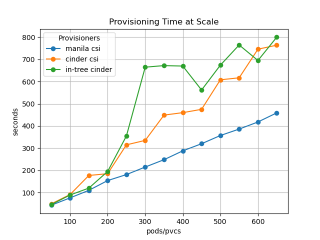

# OpenStack storage provisioners performance at scale

## The question

When using OpenStack as IIAS underneath Kubernetes, Kubernetes clusters can be deployed by regular OpenStack users, not just by OpenStack administrators.  Kubernetes clusters run on OpenStack Nova compute instances.  Pods run on the compute instances belonging to a particular OpenStack tenant and can avail themselves of persistent volumes belonging to that tenant, including dynamically provisioned storage that fulfills Persistent Volume Claims that reference Storage Classes based on native OpenStack Cinder and Manila provisioners.

### Create Times

|   Number of Pods |   csi-manila-default |   standard |   standard-csi |
|-----------------:|---------------------:|-----------:|---------------:|
|               50 |                   43 |         46 |             49 |
|              100 |                   76 |         89 |             91 |
|              150 |                  110 |        120 |            177 |
|              200 |                  154 |        195 |            185 |
|              250 |                  181 |        355 |            315 |
|              300 |                  215 |        665 |            335 |
|              350 |                  248 |        672 |            449 |
|              400 |                  288 |        670 |            460 |
|              450 |                  320 |        562 |            475 |
|              500 |                  357 |        674 |            608 |
|              550 |                  386 |        765 |            617 |
|              600 |                  418 |        695 |            746 |
|              650 |                  459 |        800 |            764 |

